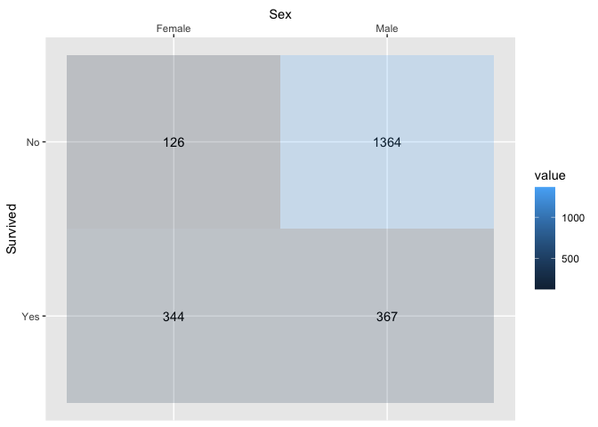

<!-- README.md is generated from README.Rmd. Please edit that file -->

# ggverbatim

<!-- badges: start -->

<!-- badges: end -->

The goal of ggverbatim is to …

## Installation

You can install the released version of ggverbatim from
[CRAN](https://CRAN.R-project.org) with:

``` r
install.packages("ggverbatim")
```

And the development version from [GitHub](https://github.com/) with:

``` r
# install.packages("devtools")
devtools::install_github("EvaMaeRey/ggverbatim")
```

## Example

This is a basic example which shows you how to solve a common problem:

``` r
# library(ggverbatim)
library(tidyverse)
#> ── Attaching packages ─────────────────────────────────────── tidyverse 1.3.0 ──
#> ✓ ggplot2 3.3.5     ✓ purrr   0.3.4
#> ✓ tibble  3.1.6     ✓ dplyr   1.0.8
#> ✓ tidyr   1.0.2     ✓ stringr 1.4.0
#> ✓ readr   1.3.1     ✓ forcats 0.5.0
#> Warning: package 'ggplot2' was built under R version 3.6.2
#> Warning: package 'tibble' was built under R version 3.6.2
#> Warning: package 'purrr' was built under R version 3.6.2
#> Warning: package 'dplyr' was built under R version 3.6.2
#> ── Conflicts ────────────────────────────────────────── tidyverse_conflicts() ──
#> x dplyr::filter() masks stats::filter()
#> x dplyr::lag()    masks stats::lag()
library(magrittr)
#> Warning: package 'magrittr' was built under R version 3.6.2
#> 
#> Attaching package: 'magrittr'
#> The following object is masked from 'package:purrr':
#> 
#>     set_names
#> The following object is masked from 'package:tidyr':
#> 
#>     extract

Titanic %>% 
  data.frame() %>% 
  tibble() %>% 
  uncount(Freq) %>% 
  count(Survived, Sex) %>% 
  pivot_wider(names_from = Sex, values_from = n) ->
vis_arrangement

vis_arrangement
#> # A tibble: 2 × 3
#>   Survived  Male Female
#>   <fct>    <int>  <int>
#> 1 No        1364    126
#> 2 Yes        367    344
```

What is special about using `README.Rmd` instead of just `README.md`?
You can include R chunks like so:

``` r
vis_arrangement %>% 
  pivot_longer(cols = -1) %>% 
ggplot() + 
  aes(x = name) + 
  labs(x = "Sex") + 
  aes(y = Survived) + 
  aes(label = value) + 
  aes(fill = value) + 
  geom_tile() + 
  geom_text() + 
  scale_x_discrete(position = "top") + 
  scale_y_discrete(limits=rev)
```


``` r


# so

ggverbatim <- function(data, rows_var = NULL, cols_var_name = "x"){
  
data %>% 
  pivot_longer(cols = -1) %>% 
ggplot() + 
  aes(x = name) + 
  labs(x = cols_var_name) + 
  aes(y = {{rows_var}}) + 
  aes(label = value) + 
  aes(fill = value) + 
  scale_x_discrete(position = "top") + 
  scale_y_discrete(limits=rev)
  
}

vis_arrangement %>% 
  ggverbatim(rows_var = Survived) + 
  geom_text() + 
  geom_tile(alpha = .2) +
  labs(x = "Sex")
```


