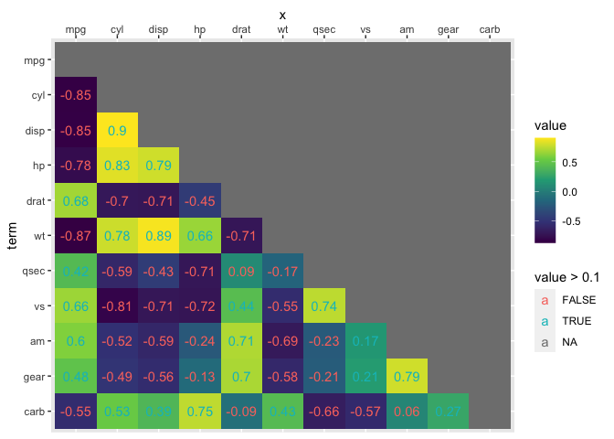

<!-- README.md is generated from README.Rmd. Please edit that file -->

# ggverbatim

<!-- badges: start -->

<!-- badges: end -->

A class of tables exists where table body values are like-in-kind. These
tables differ from data-frames, in that for most data-frames, columns
contain values of different types.

Such tables can be stored in a ‘long form’ of the data, which may be
more analytic- friendly. For example the long form, enables direct use
in tools like ggplot2 and tidypivot.

The inspiration for ggverbatim is to reproduce tables that have values
that are like-in-kind in ggplot2 in a way that feels natural. Products
like heat maps and correlations tables can be prepped as tables and then
ported to the popular data visualization tool without pivoting to
longer. This yields a closer visual match between the table input and
the visual output.

## Installation

Install the development version from [GitHub](https://github.com/) with:

``` r
# install.packages("devtools")
devtools::install_github("EvaMaeRey/ggverbatim")
```

## Motivation

ggplot requires ‘tidy’ data, usually ‘long’. You may build a table in
ggplot2, the visual arrangement isn’t tidy, but is nice for humans.

Sometimes, you will have data in an untidy format (your raw data or data
that you’ve already worked with). And you might just want to reproduce
it ggplot2 ‘verbatim’.

Currently, this would be accomplished via a pivot to long (‘unpivot’)
and then repivot through the visual specification. That is what
ggverbatim actually does under the hood. But if feels like a A1 -\> A2
process, not an A1 -\> B -\> A2 process.

``` r
# library(ggverbatim)
library(tidyverse, verbose = F)
#> ── Attaching core tidyverse packages ──────────────────────── tidyverse 2.0.0 ──
#> ✔ dplyr     1.1.0     ✔ readr     2.1.4
#> ✔ forcats   1.0.0     ✔ stringr   1.5.0
#> ✔ ggplot2   3.4.1     ✔ tibble    3.2.0
#> ✔ lubridate 1.9.2     ✔ tidyr     1.3.0
#> ✔ purrr     1.0.1     
#> ── Conflicts ────────────────────────────────────────── tidyverse_conflicts() ──
#> ✖ dplyr::filter() masks stats::filter()
#> ✖ dplyr::lag()    masks stats::lag()
#> ℹ Use the conflicted package (<http://conflicted.r-lib.org/>) to force all conflicts to become errors
library(magrittr)
#> 
#> Attaching package: 'magrittr'
#> 
#> The following object is masked from 'package:purrr':
#> 
#>     set_names
#> 
#> The following object is masked from 'package:tidyr':
#> 
#>     extract

Titanic %>% 
  data.frame() %>% 
  tibble() %>% 
  uncount(Freq) %>% 
  count(Survived, Sex) %>% 
  pivot_wider(names_from = Sex, values_from = n) ->
vis_arrangement

vis_arrangement
#> # A tibble: 2 × 3
#>   Survived  Male Female
#>   <fct>    <int>  <int>
#> 1 No        1364    126
#> 2 Yes        367    344
```

What is special about using `README.Rmd` instead of just `README.md`?
You can include R chunks like so:

``` r
vis_arrangement %>% 
  pivot_longer(cols = -1) %>% 
  ggplot() + 
  aes(x = name) + 
  labs(x = "Sex") + 
  aes(y = Survived) + 
  aes(label = value) + 
  aes(fill = value) + 
  geom_tile() + 
  geom_text() + 
  scale_x_discrete(position = "top") + 
  scale_y_discrete(limits=rev)
```


# Therefore

``` r
readLines("R/ggverbatim.R") ->
verbatim_code
```

``` r
#' Title
#'
#' @param data
#' @param row_var_name
#' @param cols_var_name
#'
#' @return
#' @export
#'
#' @examples
#' Titanic %>%
#'   data.frame() %>%
#'   tibble() %>%
#'   uncount(Freq) %>%
#'   count(Survived, Sex) %>%
#'   pivot_wider(names_from = Sex, values_from = n) ->
#'   vis_arrangement
#'
#'   vis_arrangement %>%
#'   ggverbatim()
ggverbatim <- function(data, row_var_name = NULL, cols_var_name = "x", value_var_name = NULL){

  row_var_name <- names(data)[1]
  names(data)[1] <- "row_var"

  message("Variables that can be used for aesthetic mappying are 'x', and " |> paste(row_var_name))

  col_headers <- names(data)
  col_headers <- col_headers[2:length(col_headers)]

  data %>%
    mutate(row_var = fct_inorder(row_var)) %>%
    pivot_longer(cols = -1) %>%
    mutate(name = factor(name, levels = col_headers)) %>%
    rename(x = name) ->
  pivoted

  pivoted %>%
    ggplot() +
    aes(x = x) +
    labs(x = cols_var_name) +
    aes(y = row_var) +
    labs(y = row_var_name) +
    aes(label = value) +
    aes(fill = value) +
    scale_x_discrete(position = "top") +
    scale_y_discrete(limits=rev)

}
```

``` r
vis_arrangement %>% 
  ggverbatim() +
  geom_tile(alpha = .8) +
  aes(fill = value) +
  aes(labels = value) +
  geom_text(color = "oldlace") + 
  labs(x = "Sex") + 
  theme_minimal() 
#> Variables that can be used for aesthetic mappying are 'x', and  Survived
```


# Another example; corrr

The corrr project is designed to make correlation fit the ‘tidy’
paradigmn. corrr table outputs can be manipulated like data frames.

``` r
library(MASS)
#> 
#> Attaching package: 'MASS'
#> The following object is masked from 'package:dplyr':
#> 
#>     select
library(corrr)

# Simulate three columns correlating about .7 with each other
mu <- rep(0, 3)
Sigma <- matrix(.7, nrow = 3, ncol = 3) + diag(3)*.3
seven <- mvrnorm(n = 1000, mu = mu, Sigma = Sigma)

# Simulate three columns correlating about .4 with each other
mu <- rep(0, 3)
Sigma <- matrix(.4, nrow = 3, ncol = 3) + diag(3)*.6
four <- mvrnorm(n = 1000, mu = mu, Sigma = Sigma)

# Bind together
d <- cbind(seven, four)
colnames(d) <- paste0("v", 1:ncol(d))

# Insert some missing values
d[sample(1:nrow(d), 100, replace = TRUE), 1] <- NA
d[sample(1:nrow(d), 200, replace = TRUE), 5] <- NA

# Correlate
corrr_example <- correlate(d)
#> Correlation computed with
#> • Method: 'pearson'
#> • Missing treated using: 'pairwise.complete.obs'


corrr_example %>% 
  ggverbatim() + 
  geom_tile() + 
  scale_fill_viridis_c()
#> Variables that can be used for aesthetic mappying are 'x', and  term
```


``` r

corrr_example %>% 
  ggverbatim() + 
  geom_point(aes(size = value))
#> Variables that can be used for aesthetic mappying are 'x', and  term
#> Warning: Removed 6 rows containing missing values (`geom_point()`).
```


``` r

corrr_example %>% 
  shave() %>% 
  ggverbatim() + 
  geom_tile() + 
  geom_text(aes(label = round(value, 2), color = value >.1)) +
  scale_fill_viridis_c()
#> Variables that can be used for aesthetic mappying are 'x', and  term
#> Warning: Removed 21 rows containing missing values (`geom_text()`).
```


``` r
corrr_example <- correlate(mtcars)
#> Correlation computed with
#> • Method: 'pearson'
#> • Missing treated using: 'pairwise.complete.obs'

corrr_example
#> # A tibble: 11 × 12
#>    term     mpg    cyl   disp     hp    drat     wt    qsec     vs      am
#>    <chr>  <dbl>  <dbl>  <dbl>  <dbl>   <dbl>  <dbl>   <dbl>  <dbl>   <dbl>
#>  1 mpg   NA     -0.852 -0.848 -0.776  0.681  -0.868  0.419   0.664  0.600 
#>  2 cyl   -0.852 NA      0.902  0.832 -0.700   0.782 -0.591  -0.811 -0.523 
#>  3 disp  -0.848  0.902 NA      0.791 -0.710   0.888 -0.434  -0.710 -0.591 
#>  4 hp    -0.776  0.832  0.791 NA     -0.449   0.659 -0.708  -0.723 -0.243 
#>  5 drat   0.681 -0.700 -0.710 -0.449 NA      -0.712  0.0912  0.440  0.713 
#>  6 wt    -0.868  0.782  0.888  0.659 -0.712  NA     -0.175  -0.555 -0.692 
#>  7 qsec   0.419 -0.591 -0.434 -0.708  0.0912 -0.175 NA       0.745 -0.230 
#>  8 vs     0.664 -0.811 -0.710 -0.723  0.440  -0.555  0.745  NA      0.168 
#>  9 am     0.600 -0.523 -0.591 -0.243  0.713  -0.692 -0.230   0.168 NA     
#> 10 gear   0.480 -0.493 -0.556 -0.126  0.700  -0.583 -0.213   0.206  0.794 
#> 11 carb  -0.551  0.527  0.395  0.750 -0.0908  0.428 -0.656  -0.570  0.0575
#> # … with 2 more variables: gear <dbl>, carb <dbl>

corrr_example %>% 
  ggverbatim() + 
  geom_tile() + 
  scale_fill_viridis_c()
#> Variables that can be used for aesthetic mappying are 'x', and  term
```


``` r

corrr_example %>% 
  ggverbatim() + 
  geom_point(aes(size = value))
#> Variables that can be used for aesthetic mappying are 'x', and  term
#> Warning: Removed 11 rows containing missing values (`geom_point()`).
```


``` r

corrr_example %>% 
  shave() %>% 
  ggverbatim() + 
  geom_tile() + 
  geom_text(aes(label = round(value, 2), color = value >.1)) +
  scale_fill_viridis_c()
#> Variables that can be used for aesthetic mappying are 'x', and  term
#> Warning: Removed 66 rows containing missing values (`geom_text()`).
```


