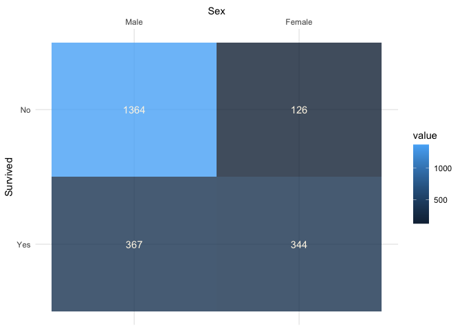
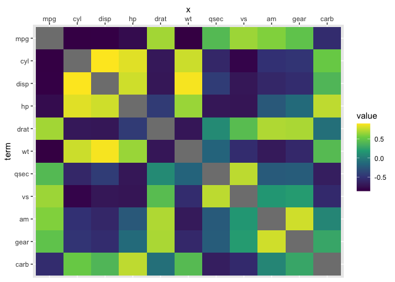
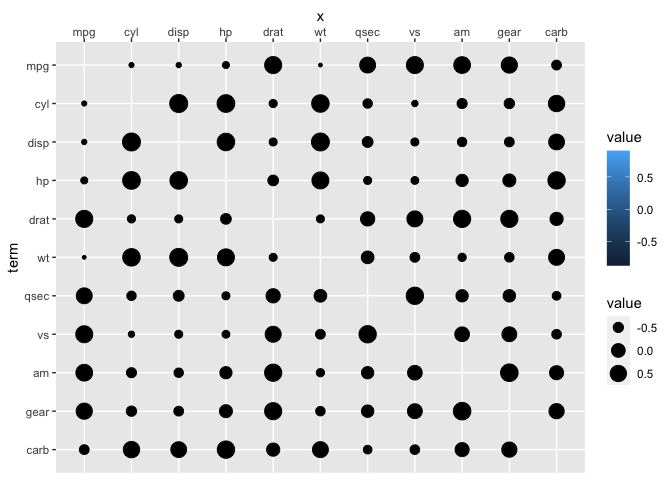
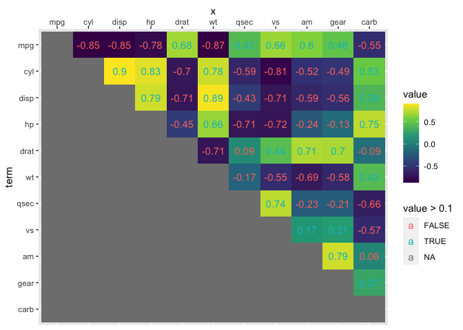

<!-- README.md is generated from README.Rmd. Please edit that file -->

# ggverbatim

<!-- badges: start -->

<!-- badges: end -->

Some tables have body’s with values that are like-in-kind (LIK tables).
These tables differ from data-frames, as most data-frames columns’
contain values of different types.

Tables that have bodies with like-in-kind values can arise from cross
tabulation, correlation analyses, and storage of time series data, for
example.

``` r
Titanic[ , , Age = "Child", Survived = "No"]
#>       Sex
#> Class  Male Female
#>   1st     0      0
#>   2nd     0      0
#>   3rd    35     17
#>   Crew    0      0
```

To use such data with the popular data visualization tool ggplot2, data
is usually pivoted to its long form, where most of the column names
(e.g. years in time series wide storage) are stored in a single column.

ggverbatim aims to faithfully reproduce input LIK in ggplot2 without the
pivoting step. Thus, products like heat maps and correlations tables can
be prepped as tables and directly ported to a ggplot2 build via the
ggverbatim() function without pivoting to longer. Users also won’t need
without specifying factor ordering. Thus, we provide an interface for a
close visual match between the table input and the visual output.

## Installation

Install the development version from [GitHub](https://github.com/) with:

``` r
# install.packages("devtools")
devtools::install_github("EvaMaeRey/ggverbatim")
```

## Motivation

ggplot requires ‘tidy’ data, usually ‘long’. You may build a table in
ggplot2, the visual arrangement isn’t tidy, but is nice for humans.

Sometimes, you will have data in an untidy format (your raw data or data
that you’ve already worked with). And you might just want to reproduce
it ggplot2 ‘verbatim’.

Currently, this would be accomplished via a pivot to long (‘unpivot’)
and then wide-pivoted through the visual specification. That is what
ggverbatim actually does under the hood. But if feels like a A1 -\> A2
process, not an A1 -\> B -\> A2 process.

``` r
# library(ggverbatim)
library(tidyverse, verbose = F)
#> ── Attaching core tidyverse packages ─────────────────── tidyverse 2.0.0.9000 ──
#> ✔ dplyr     1.1.0          ✔ readr     2.1.4     
#> ✔ forcats   1.0.0          ✔ stringr   1.5.0     
#> ✔ ggplot2   3.4.4.9000     ✔ tibble    3.2.1     
#> ✔ lubridate 1.9.2          ✔ tidyr     1.3.0     
#> ✔ purrr     1.0.1          
#> ── Conflicts ────────────────────────────────────────── tidyverse_conflicts() ──
#> ✖ dplyr::filter() masks stats::filter()
#> ✖ dplyr::lag()    masks stats::lag()
#> ℹ Use the conflicted package (<http://conflicted.r-lib.org/>) to force all conflicts to become errors
library(magrittr)
#> 
#> Attaching package: 'magrittr'
#> 
#> The following object is masked from 'package:purrr':
#> 
#>     set_names
#> 
#> The following object is masked from 'package:tidyr':
#> 
#>     extract

Titanic %>% 
  data.frame() %>% 
  tibble() %>% 
  uncount(Freq) %>% 
  count(Survived, Sex) %>% 
  pivot_wider(names_from = Sex, values_from = n) ->
vis_arrangement

vis_arrangement
#> # A tibble: 2 × 3
#>   Survived  Male Female
#>   <fct>    <int>  <int>
#> 1 No        1364    126
#> 2 Yes        367    344
```

``` r
vis_arrangement %>% 
  pivot_longer(cols = -1) %>% 
  ggplot() + 
  aes(x = name) + 
  labs(x = "Sex") + 
  aes(y = Survived) + 
  aes(label = value) + 
  aes(fill = value) + 
  geom_tile() + 
  geom_text() + 
  scale_x_discrete(position = "top") + 
  scale_y_discrete(limits=rev)
```


# Therefore

``` r
knitrExtra:::chunk_to_r("ggverbatim")
#> It seems you are currently knitting a Rmd/Qmd file. The parsing of the file will be done in a new R session.
```

``` r
#' Title
#'
#' @param data
#' @param row_var_name
#' @param cols_var_name
#'
#' @return
#' @export
#'
#' @examples
#' Titanic %>%
#'   data.frame() %>%
#'   tibble() %>%
#'   uncount(Freq) %>%
#'   count(Survived, Sex) %>%
#'   pivot_wider(names_from = Sex, values_from = n) ->
#'   vis_arrangement
#'
#'   vis_arrangement %>%
#'   ggverbatim()
ggverbatim <- function(data, cat_cols = 1,  row_var_name = NULL, cols_var_name = "x", value_var_name = NULL){

  message("Variables that represented visually are ; e.g.  aesthetic mappying are 'x', and " |> paste(row_var_name))

  row_var_name <- names(data)[1]
  names(data)[1] <- "row_var"

  col_headers <- names(data)
  col_headers <- col_headers[2:length(col_headers)]

  data %>%
    mutate(row_var = fct_inorder(row_var)) %>%
    pivot_longer(cols = -cat_cols) %>%
    mutate(name = factor(name, levels = col_headers)) %>%
    rename(x = name) ->
  pivoted

  pivoted %>%
    ggplot() +
    aes(x = x) +
    labs(x = cols_var_name) +
    aes(y = row_var) +
    labs(y = row_var_name) +
    aes(label = value) +
    aes(fill = value) +
    scale_x_discrete(position = "top") +
    scale_y_discrete(limits=rev)

}
```

``` r
vis_arrangement %>% 
  ggverbatim() +
  geom_tile(alpha = .8) +
  aes(fill = value) +
  aes(labels = value) +
  geom_text(color = "oldlace") + 
  labs(x = "Sex") + 
  theme_minimal() 
#> Variables that represented visually are ; e.g.  aesthetic mappying are 'x', and
#> Warning: Using an external vector in selections was deprecated in tidyselect 1.1.0.
#> ℹ Please use `all_of()` or `any_of()` instead.
#>   # Was:
#>   data %>% select(cat_cols)
#> 
#>   # Now:
#>   data %>% select(all_of(cat_cols))
#> 
#> See <https://tidyselect.r-lib.org/reference/faq-external-vector.html>.
#> This warning is displayed once every 8 hours.
#> Call `lifecycle::last_lifecycle_warnings()` to see where this warning was
#> generated.
```



# Another example; corrr

The corrr project is designed to make correlation fit the ‘tidy’
paradigmn. the output of correlate is treated like a data frames in the
ggplot2 setting due to the dispatch methods used.

``` r
library(corrr)
corrr_example <- correlate(mtcars)
#> Correlation computed with
#> • Method: 'pearson'
#> • Missing treated using: 'pairwise.complete.obs'

corrr_example
#> # A tibble: 11 × 12
#>    term     mpg    cyl   disp     hp    drat     wt    qsec     vs      am
#>    <chr>  <dbl>  <dbl>  <dbl>  <dbl>   <dbl>  <dbl>   <dbl>  <dbl>   <dbl>
#>  1 mpg   NA     -0.852 -0.848 -0.776  0.681  -0.868  0.419   0.664  0.600 
#>  2 cyl   -0.852 NA      0.902  0.832 -0.700   0.782 -0.591  -0.811 -0.523 
#>  3 disp  -0.848  0.902 NA      0.791 -0.710   0.888 -0.434  -0.710 -0.591 
#>  4 hp    -0.776  0.832  0.791 NA     -0.449   0.659 -0.708  -0.723 -0.243 
#>  5 drat   0.681 -0.700 -0.710 -0.449 NA      -0.712  0.0912  0.440  0.713 
#>  6 wt    -0.868  0.782  0.888  0.659 -0.712  NA     -0.175  -0.555 -0.692 
#>  7 qsec   0.419 -0.591 -0.434 -0.708  0.0912 -0.175 NA       0.745 -0.230 
#>  8 vs     0.664 -0.811 -0.710 -0.723  0.440  -0.555  0.745  NA      0.168 
#>  9 am     0.600 -0.523 -0.591 -0.243  0.713  -0.692 -0.230   0.168 NA     
#> 10 gear   0.480 -0.493 -0.556 -0.126  0.700  -0.583 -0.213   0.206  0.794 
#> 11 carb  -0.551  0.527  0.395  0.750 -0.0908  0.428 -0.656  -0.570  0.0575
#> # ℹ 2 more variables: gear <dbl>, carb <dbl>

corrr_example %>% 
  ggverbatim() + 
  geom_tile() + 
  scale_fill_viridis_c()
#> Variables that represented visually are ; e.g.  aesthetic mappying are 'x', and
```



``` r

corrr_example %>% 
  ggverbatim() + 
  geom_point(aes(size = value))
#> Variables that represented visually are ; e.g.  aesthetic mappying are 'x', and
#> Warning: Removed 11 rows containing missing values or values outside the scale range
#> (`geom_point()`).
```



``` r

corrr_example %>% 
  shave(upper = FALSE) %>% 
  ggverbatim() + 
  geom_tile() + 
  geom_text(aes(label = round(value, 2), color = value >.1)) +
  scale_fill_viridis_c()
#> Variables that represented visually are ; e.g.  aesthetic mappying are 'x', and
#> Warning: Removed 66 rows containing missing values or values outside the scale range
#> (`geom_text()`).
```



``` r

last_plot() +
  geom_tile(data = . %>% filter(value > .7), 
            color = "red", 
            linewidth = 1.5, 
            fill = alpha("red", .2))
#> Warning: Removed 66 rows containing missing values or values outside the scale range
#> (`geom_text()`).
```


# time series example

``` r
library(dplyr)
dat <- read_csv("data-raw/API_AG.LND.ARBL.ZS_DS2_en_csv_v2_5734536/API_AG.LND.ARBL.ZS_DS2_en_csv_v2_5734536.csv", skip = 3) 

dat %>% 
  arrange(-`1961`) %>%  
  select(`Country Name`, `1961`:`1970`) %>% 
  slice(1:10) %>% 
  ggverbatim() + 
  geom_tile(color = "white") + 
  geom_text(color = "white")
```
